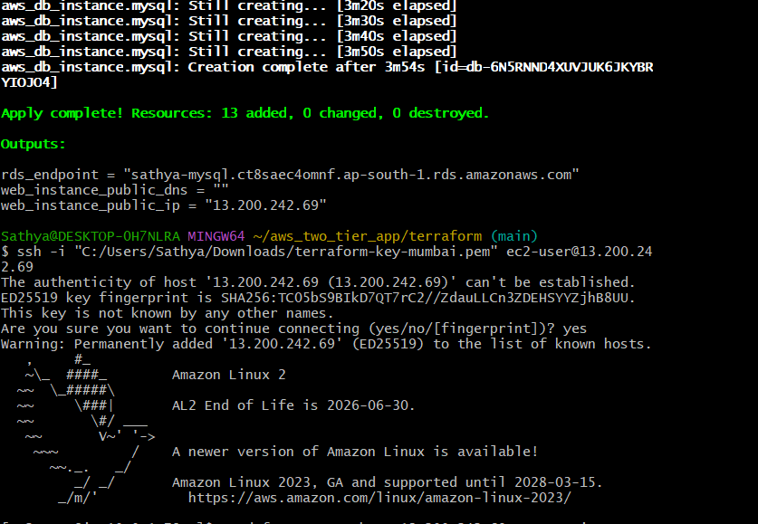
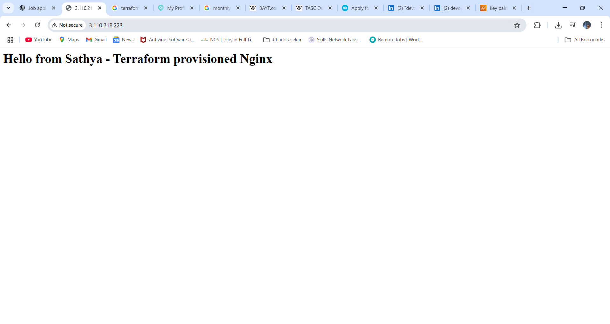

“This project deploys a 2-tier application (web + database) on AWS using Terraform and AWS free tier resources.”

[] 

# AWS Two-Tier App Terraform Deployment

| Component | Resource Created        |
| --------- | ----------------------- |
| Web Tier  | EC2 with Nginx (Public) |
| DB Tier   | RDS MySQL (Private)     |

## Project Overview
This project uses Terraform to deploy a two-tier architecture on AWS:
- An EC2 instance running **Nginx** as a web server.
- Security groups configured to allow SSH and HTTP access.
- Terraform manages all the infrastructure as code for easy repeatability.

## Prerequisites
- AWS account with appropriate permissions.
- Terraform installed (version X.X.X).
- AWS CLI configured (optional but recommended).
- EC2 key pair for SSH access (e.g., `terraform-key-mumbai.pem`).
- Your public IP whitelisted for SSH access in security group.

## How to Run

1. Clone the repo:
   ```bash
   git clone https://github.com/your-username/aws_two_tier_app.git
   cd aws_two_tier_app/terraform

2. Replace variables in variables.tf or use terraform.tfvars file:

. key_name = your EC2 key pair name

. ssh_allowed_ip = your current public IP (get it from whatismyip)

3. Initialize Terraform:

bash

terraform init

4. Apply Terraform configuration:

bash

terraform apply
Confirm by typing yes.

5. Once apply is done, note the public IP output.

Screenshots

`

Open your browser and visit:

cpp

http://<your-ec2-public-ip>
You should see the Nginx welcome page.

Screenshots

Screenshot of the Nginx default page served by the EC2 instance.

`

ADD CONNECTION TEST : EC2 can connect to RDS by including:

ssh -i "terraform-key-mumbai.pem" ec2-user@13.233.142.207
# then inside:
sudo yum install -y mariadb
mysql -h mydb.xxxx.ap-south-1.rds.amazonaws.com -u appuser -p
[ec2-user@ip-10-0-1-78 ~]$ curl localhost
<h1>Hello from Sathya - Terraform provisioned Nginx</h1>

let’s complete the two-tier app setup by creating a sample DB + table in your RDS from the EC2 instance.

👉 You’re already inside the MySQL prompt (MySQL [(none)]>), so run these commands step by step:

[ec2-user@ip-10-0-1-78 ~]$ mysql -h sathya-mysql.ct8saec4omnf.ap-south-1.rds.amazonaws.com -u appuser -p
Enter password:
ERROR 1045 (28000): Access denied for user 'appuser'@'10.0.1.78' (using password: YES)
[ec2-user@ip-10-0-1-78 ~]$ mysql -h sathya-mysql.ct8saec4omnf.ap-south-1.rds.amazonaws.com -u appuser -p
Enter password:
Welcome to the MariaDB monitor.  Commands end with ; or \g.
Your MySQL connection id is 67
Server version: 8.0.42 Source distribution

Copyright (c) 2000, 2018, Oracle, MariaDB Corporation Ab and others.

Type 'help;' or '\h' for help. Type '\c' to clear the current input statement.

MySQL [(none)]> CREATE DATABASE myappdb;

2️⃣ Switch to the new DB
USE myappdb;

3️⃣ Create a table
CREATE TABLE users (
    id INT AUTO_INCREMENT PRIMARY KEY,
    name VARCHAR(50),
    email VARCHAR(100)
);

4️⃣ Insert some sample data
INSERT INTO users (name, email) VALUES 
('Sathya', 'sathya@example.com'),
('Shobi Kutty', 'shobi@example.com');

5️⃣ Verify the data
SELECT * FROM users;

MySQL [myappdb]> SELECT * FROM users;
+----+-------------+--------------------+
| id | name        | email              |
+----+-------------+--------------------+
|  1 | Sathya      | sathya@example.com |
|  2 | Shobi Kutty | shobi@example.com  |
+----+-------------+--------------------+
2 rows in set (0.00 sec)
EC2 App Tier → RDS DB Tier connectivity is working. 🚀

**🗑️ Cleanup (Important! Runs all resource destroy):**

To destroy all resources and avoid billing:

emphasize that RDS must be destroyed or it may incur charges even after t2.micro free tier.

bash

terraform destroy
Type yes to confirm.

Destroy complete! Resources: 7 destroyed.


Notes
Make sure your .pem key file permissions are secure.

This Terraform code is for learning/demo purpose — do not use in production without security review.

Author Block
Sathya Pillai Sudalai
GitHub: https://github.com/PillaiSathya


